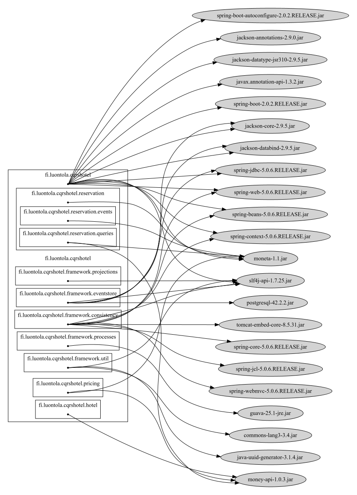

# Example output

This is example report produced from https://github.com/luontola/cqrs-hotel

## Graph



## Console output

```
fi.luontola.cqrshotel -> jackson-annotations-2.9.0.jar
fi.luontola.cqrshotel -> jackson-core-2.9.5.jar
fi.luontola.cqrshotel -> jackson-databind-2.9.5.jar
fi.luontola.cqrshotel -> jackson-datatype-jsr310-2.9.5.jar
fi.luontola.cqrshotel -> javax.annotation-api-1.3.2.jar
fi.luontola.cqrshotel -> moneta-1.1.jar
fi.luontola.cqrshotel -> slf4j-api-1.7.25.jar
fi.luontola.cqrshotel -> spring-beans-5.0.6.RELEASE.jar
fi.luontola.cqrshotel -> spring-boot-2.0.2.RELEASE.jar
fi.luontola.cqrshotel -> spring-boot-autoconfigure-2.0.2.RELEASE.jar
fi.luontola.cqrshotel -> spring-context-5.0.6.RELEASE.jar
fi.luontola.cqrshotel -> spring-jdbc-5.0.6.RELEASE.jar
fi.luontola.cqrshotel -> spring-web-5.0.6.RELEASE.jar
fi.luontola.cqrshotel.framework.consistency -> slf4j-api-1.7.25.jar
fi.luontola.cqrshotel.framework.consistency -> spring-beans-5.0.6.RELEASE.jar
fi.luontola.cqrshotel.framework.consistency -> spring-context-5.0.6.RELEASE.jar
fi.luontola.cqrshotel.framework.consistency -> spring-core-5.0.6.RELEASE.jar
fi.luontola.cqrshotel.framework.consistency -> spring-jcl-5.0.6.RELEASE.jar
fi.luontola.cqrshotel.framework.consistency -> spring-web-5.0.6.RELEASE.jar
fi.luontola.cqrshotel.framework.consistency -> spring-webmvc-5.0.6.RELEASE.jar
fi.luontola.cqrshotel.framework.consistency -> tomcat-embed-core-8.5.31.jar
fi.luontola.cqrshotel.framework.eventstore -> jackson-core-2.9.5.jar
fi.luontola.cqrshotel.framework.eventstore -> jackson-databind-2.9.5.jar
fi.luontola.cqrshotel.framework.eventstore -> postgresql-42.2.2.jar
fi.luontola.cqrshotel.framework.eventstore -> slf4j-api-1.7.25.jar
fi.luontola.cqrshotel.framework.eventstore -> spring-jdbc-5.0.6.RELEASE.jar
fi.luontola.cqrshotel.framework.processes -> guava-25.1-jre.jar
fi.luontola.cqrshotel.framework.projections -> slf4j-api-1.7.25.jar
fi.luontola.cqrshotel.framework.util -> commons-lang3-3.4.jar
fi.luontola.cqrshotel.framework.util -> java-uuid-generator-3.1.4.jar
fi.luontola.cqrshotel.framework.util -> slf4j-api-1.7.25.jar
fi.luontola.cqrshotel.hotel -> money-api-1.0.3.jar
fi.luontola.cqrshotel.pricing -> moneta-1.1.jar
fi.luontola.cqrshotel.pricing -> money-api-1.0.3.jar
fi.luontola.cqrshotel.reservation -> moneta-1.1.jar
fi.luontola.cqrshotel.reservation.events -> moneta-1.1.jar
fi.luontola.cqrshotel.reservation.queries -> moneta-1.1.jar
fi.luontola.cqrshotel.reservation.queries -> money-api-1.0.3.jar
```

